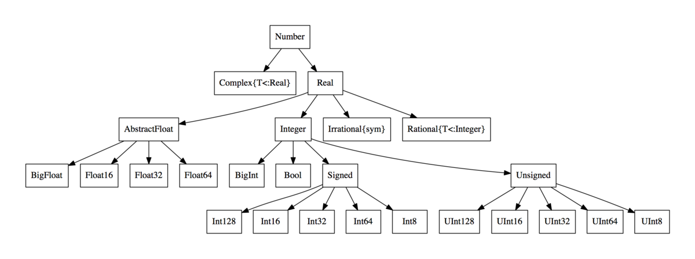

Special features of Julia
=========================

.. questions::

   - What sets Julia apart from other languages?
   - How can a dynamically-typed language still be based on an elaborate type system?
   - What is multiple dispatch?

.. objectives::

   - Get an overview of Julia's type system and how it underpins the language
   - Understand why Julia is fast
   - Learn about multiple dispatch and how it's used
   - Know how Julia code can be introspected to improve performance
   - Know how scoping in Julia works

Types
-----

-  Good practices, e.g. when to declare types
-  Explain how multiple dispatch works
-  Using macros, show differences in low-level code depending on how
   types are used

Julia is a dynamically typed language and does not require the
declaration of types. Counterintuitively, it is notetheless due to its
sophisticated type system that Julia is a high-performance language!
This is because types are *inferred* and used when Julia is run.

Julia’s type system is also what enables “multiple dispatch” on function
argument types - this is what sets the language apart from most other
languages and makes it fast when combined with JIT and LLVM.

Since types play a fundamental role in Julia’s design it’s important to
have a mental model of Julia’s type system. There are two basic kinds of
types in Julia: - **Abstract types**: Define the kind of a thing,
i.e. represent sets of related types. - **Concrete types**: Describe
data structures, i.e. concrete implementations that can be used for
variables.

.. code-block:: julia

    typeof(1)


.. code-block:: text

    Int64


.. code-block:: julia

    typeof(1.0)


.. code-block:: text

    Float64


.. code-block:: julia

    supertypes(Float64)


.. code-block:: text

    (Float64, AbstractFloat, Real, Number, Any)


.. code-block:: julia

    subtypes(Real)


.. code-block:: text

    4-element Vector{Any}:
     AbstractFloat
     AbstractIrrational
     Integer
     Rational


Types in Julia form a “type tree”, in which the leaves are concrete
types.



Derived types
~~~~~~~~~~~~~

New types, i.e. new kinds of data structures, can be defined with the
``struct`` keyword, or ``mutable struct`` if you want to be able to
change the values of fields in the new data structure. To take a
classical example:

.. code-block:: julia

    struct Point2D
        x
        y
    end

A new ``Point`` object can be defined by

.. code-block:: julia

    p = Point(1.1, 2.2)


:: code-block:: text


    UndefVarError: Point not defined

    

    Stacktrace:

     [1] top-level scope

       @ In[6]:1

     [2] eval

       @ ./boot.jl:360 [inlined]

     [3] include_string(mapexpr::typeof(REPL.softscope), mod::Module, code::String, filename::String)

       @ Base ./loading.jl:1094


and its elements accessed by

.. code-block:: julia

    p.x


::


    UndefVarError: p not defined

    

    Stacktrace:

     [1] top-level scope

       @ In[7]:1

     [2] eval

       @ ./boot.jl:360 [inlined]

     [3] include_string(mapexpr::typeof(REPL.softscope), mod::Module, code::String, filename::String)

       @ Base ./loading.jl:1094


Parametric types
~~~~~~~~~~~~~~~~

A useful feature of Julia’s type system are *type parameters*: the
ability to use parameters when defining types. For example:

.. code-block:: julia

    struct Point{T}
        x::T
        y::T
    end

We can now create ``Point`` variables with explicitly different types:

.. code-block:: julia

    x1 = Point(1,2)


.. code-block:: text

    Point{Int64}(1, 2)

.. code-block:: julia

    x2 = Point(1.0, 2.0)


.. code-block:: text

    Point{Float64}(1.0, 2.0)


Functions and methods
---------------------

Functions form the backbone of any Julia code. Their syntax is
straighforward:

.. code-block:: julia

    function sumsquare(x, y)
        return x^2 + y^2
    end


.. code-block:: text

    sumsquare (generic function with 1 method)


.. code-block:: julia

    sumsquare(2.72, 3.83)


.. code-block:: text

    22.067300000000003


.. code-block:: julia

    sumsquare(2, 3)


.. code-block:: text

    13


Note that our ``sumsquare`` function has no type annotations. The base
library of Julia has different implementations of ``+`` and ``^`` which
will be chosen (“dispatched”) at runtime according to the argument
types.

In most cases it’s fine to omit types. The main reasons for adding type
annotate are: - Improve readability - Catch errors - Take advantage of
**multiple dispatch** by implementing different meethods to the same
function.

Let’s see how we can add a new **method** to our ``sumsquare``
**function** and dispatch on our ``Point`` type.

.. code-block:: julia

    function sumsquare(p1::Point, p2::Point)
        return Point(p1.x^2 + p2.x^2, p1.y^2 + p2.y^2)
    end


.. code-block:: text

    sumsquare (generic function with 2 methods)


Note the output, ``sumsquare`` is now a “generic function with 2
methods”.

.. code-block:: julia

    p1 = Point(1, 2)
    p2 = Point(3, 4)
    sumsquare(p1, p2)


.. code-block:: text

    Point{Int64}(10, 20)


.. code-block:: julia

    cp1 = Point(1+1im, 2+2im)
    cp2 = Point(3+3im, 4+4im)
    sumsquare(cp1, cp2)


.. code-block:: text

    Point{Complex{Int64}}(0 + 20im, 0 + 40im)


We can list all methods defined for a function:

.. code-block:: julia

    methods(sumsquare)


.. raw:: html

    # 2 methods for generic function <b>sumsquare</b>:<ul><li> sumsquare(p1::<b>Point</b>, p2::<b>Point</b>) in Main at In[13]:1</li> <li> sumsquare(x, y) in Main at In[10]:1</li> </ul>


\```{callout} Methods and functions

-  A **function** describing the “what” can have multiple **methods**
   describing the “how”
-  This differs from object-oriented languages in which objects (not
   functions) have methods
-  **Multiple dispatch** is when Julia selects the most specialized
   method to run based on the types of all input arguments
-  **Best practice**: constrain argument types to the widest possible
   level, and introduce constraints only if you know other argument
   types will fail. \``\`

-  mention speed for derived datatypes

Just in time compilation
~~~~~~~~~~~~~~~~~~~~~~~~

Julia relies on just-in-time (JIT) compilation and the
`LLVM <https://llvm.org/>`__ compiler infrastructure to compile its
source code. The Julia runtime code generator produces an LLVM
**Intermediate Representation** (IR) which the LLMV compiler then
converts to machine code using sophisticated optimization technology.

\```{callout} Just-in-time compilation vs interpreted and compiled
languages

-  Interpreted languages rely on a runtime which directly executes the
   source code.
-  Compiled languages rely on ahead-of-time compilation where source
   code is converted to an executable before execution.
-  Just-in-time compilation is when code is compiled to machine code at
   runtime. \``\`

To see the code that’s generated by the JIT compiler, we can use a
*macro*:

.. code-block:: julia

    @code_llvm(sumsquare(p1, p2))


.. code-block:: text

    ;  @ In[13]:1 within `sumsquare'
    define void @julia_sumsquare_1944([2 x i64]* noalias nocapture sret %0, [2 x i64]* nocapture nonnull readonly align 8 dereferenceable(16) %1, [2 x i64]* nocapture nonnull readonly align 8 dereferenceable(16) %2) {
    top:
    ;  @ In[13]:2 within `sumsquare'
    ; ┌ @ intfuncs.jl:312 within `literal_pow'
    ; │┌ @ int.jl:88 within `*'
        %3 = bitcast [2 x i64]* %1 to <2 x i64>*
        %4 = load <2 x i64>, <2 x i64>* %3, align 8
        %5 = mul <2 x i64> %4, %4
        %6 = bitcast [2 x i64]* %2 to <2 x i64>*
        %7 = load <2 x i64>, <2 x i64>* %6, align 8
        %8 = mul <2 x i64> %7, %7
    ; └└
    ; ┌ @ int.jl:87 within `+'
       %9 = add <2 x i64> %8, %5
    ; └
      %10 = bitcast [2 x i64]* %0 to <2 x i64>*
      store <2 x i64> %9, <2 x i64>* %10, align 8
      ret void
    }


.. code-block:: julia

    @code_lowered(sumsquare(p1, p2))


.. code-block:: text

    CodeInfo(
    1 ─ %1  = Base.getproperty(p1, :x)
    │   %2  = Core.apply_type(Base.Val, 2)
    │   %3  = (%2)()
    │   %4  = Base.literal_pow(Main.:^, %1, %3)
    │   %5  = Base.getproperty(p2, :x)
    │   %6  = Core.apply_type(Base.Val, 2)
    │   %7  = (%6)()
    │   %8  = Base.literal_pow(Main.:^, %5, %7)
    │   %9  = %4 + %8
    │   %10 = Base.getproperty(p1, :y)
    │   %11 = Core.apply_type(Base.Val, 2)
    │   %12 = (%11)()
    │   %13 = Base.literal_pow(Main.:^, %10, %12)
    │   %14 = Base.getproperty(p2, :y)
    │   %15 = Core.apply_type(Base.Val, 2)
    │   %16 = (%15)()
    │   %17 = Base.literal_pow(Main.:^, %14, %16)
    │   %18 = %13 + %17
    │   %19 = Main.Point(%9, %18)
    └──       return %19
    )


.. code-block:: julia

    @code_typed(sumsquare(1.2, 2.3))


.. code-block:: text

    CodeInfo(
    1 ─ %1 = Base.mul_float(x, x)::Float64
    │   %2 = Base.mul_float(y, y)::Float64
    │   %3 = Base.add_float(%1, %2)::Float64
    └──      return %3
    ) => Float64


.. code-block:: julia

    @code_warntype(sumsquare(1.2, 2.3))


.. code-block:: text

    Variables
      #self#::Core.Const(sumsquare)
      x::Float64
      y::Float64
    
    Body::Float64
    1 ─ %1 = Core.apply_type(Base.Val, 2)::Core.Const(Val{2})
    │   %2 = (%1)()::Core.Const(Val{2}())
    │   %3 = Base.literal_pow(Main.:^, x, %2)::Float64
    │   %4 = Core.apply_type(Base.Val, 2)::Core.Const(Val{2})
    │   %5 = (%4)()::Core.Const(Val{2}())
    │   %6 = Base.literal_pow(Main.:^, y, %5)::Float64
    │   %7 = (%3 + %6)::Float64
    └──      return %7


Code introspection
------------------

-  @code_lowered
-  @code_typed & @code_warntype
-  @code_llvm
-  @code_native

**use pi-estimation example and run introspection on different function
definitions**

Structure of a Julia program
----------------------------

-  look at a largish Julia package
-  discuss scope and its rules

See also
--------

-  https://slides.com/valentinchuravy/julia-parallelism#/1/1

