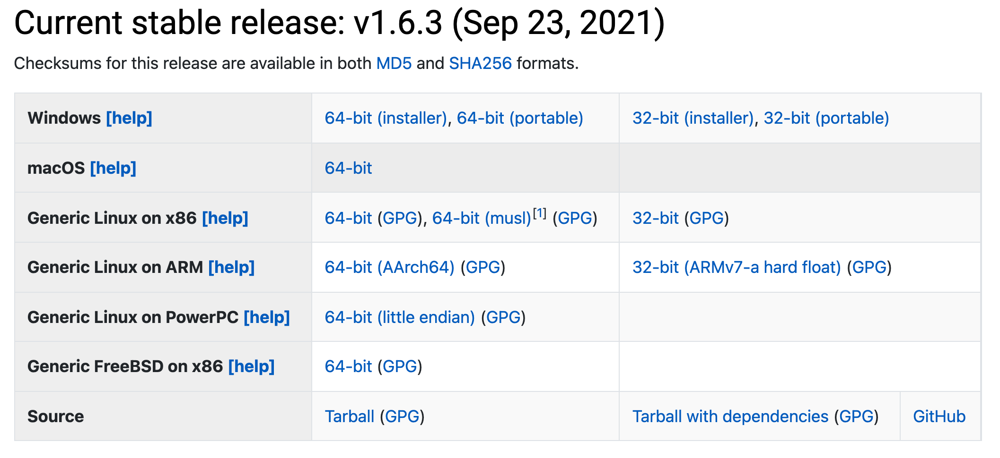

Setup
=====

Open a terminal
---------------

To run Julia as a command line program you will need a terminal.
Both MacOS and Linux have inbuilt terminal programs. It doesn't matter
whether it's set up to use ``bash``, ``zsh`` or any other shell.

For Windows users who do not already have a terminal installed,
we recommend to install the `Windows Terminal from the Microsoft Store <https://www.microsoft.com/sv-se/p/windows-terminal/9n0dx20hk701?rtc=1&activetab=pivot:overviewtab>`_.

Installing Julia
----------------

First download the latest stable release of Julia for your operating system 
`from the julialang.org website <https://julialang.org/downloads/#current_stable_release>`_.

Follow the instructions to complete the installation.

Also make sure to add Julia to your PATH by following the instructions at
https://julialang.org/downloads/platform/.

After these steps, please ensure that you can open the Julia REPL by
typing ``julia`` on the command line in a terminal. You will hopefully
see something like in the image below.

.. figure:: img/repl.png
   :align: center

To exit the REPL again, hit ``CTRL-d`` or type ``exit()``.
	   
Installing JupyterLab and a Julia kernel
----------------------------------------

JupyterLab can most easily be installed through the full
Anaconda distribution of Python packages or the minimal
Miniconda distribution.

To install Anaconda, visit
https://www.anaconda.com/products/individual , download an installer
for your operating system and follow the instructions. JupyterLab and
an IPython kernel are included in the distribution.

To install Miniconda, visit
https://docs.conda.io/en/latest/miniconda.html , download an installer
for your operating system and follow the instructions.  After
activating a ``conda`` environment in your terminal, you can install
JupyterLab with the command ``conda install jupyterlab``.

Add Julia to JupyterLab
-----------------------

To be able to use a Julia kernel in a Jupyter notebook you need to
install the ``IJulia`` Julia package. Open the Julia REPL and type::

  using Pkg
  Pkg.add("IJulia")

Create a Julia notebook
-----------------------

Now you should be able to open up a JupyterLab session by typing
``jupyter-lab`` in a terminal, and create a Julia notebook by clicking
on Julia in the JupyterLab Launcher or by selecting File > New > Notebook
and selecting a Julia kernel in the drop-down menu that appears.

